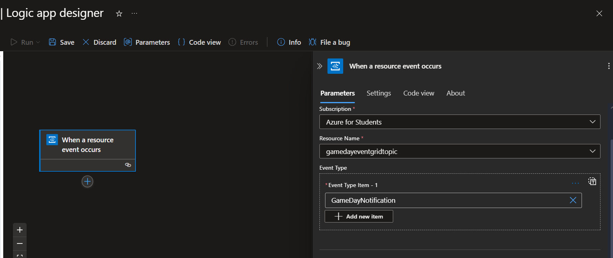

# 30 Days DevOps Challenge - Game Data Notificaion System with Terraform
**08_terraform_automating_game_day_notification**
**Week 3 - Day 4:** Terraform: Automating Game Day Notification System


## Project Overview
Just like the previous project: [02_game_day_notifications](https://github.com/Jekwulum/02_game_day_notifications), this project automates fetching sports updates from a sports API, processes the data, and sends email notifications to emails using Azure services.

- External API Integration [Link to Sportsdata website](http://sportsdata.io/ "Sportsdata.io API")
- Azure Function App,
- Azure EventGrid
- Azure Logic App
- Version Control (Git)
- Python Development
- Error Handling
- Environment Management

## Features
- The timer trigger in the function app triggers a fetch of sports data from the Sportsdata API
- Processes the data to the suitable format
- Sends the data to the EventGrid which has a topic/subscriber feature
- The Logic App which is subscribed to the EventGrid topic receives the data from the EventGrid and sends an email with Outlook through a workflow

## Prerequisites
- Python 3.x (for Function App development)
- Azure CLI installed and logged in
- Azure Account: An active Azure subscription.
- Azure Blob Storage: To store raw JSON data.
- SportsData API key
- Terraform

## Dependencies
- python-dotenv
- requests
- azure-eventgrid
- azure-functions
- python-dotenv

## Project Structure
```shell
08_terraform_automating_game_day_notification/
├── function_app.py # Python function app with timer trigger
├── nba_notifications.py # Game notifications class
├── .gitignore
├── .host.json
├── .env
├── .env.example
├── requirements.txt
├── main.tf # Defines the Azure provider and resources
├── variables.tf # Declares input variables for configuration,
└── README.md
```

# steps
1. Clone the repository
  ```shell
  git clone git@github.com:Jekwulum/08_terraform_automating_game_day_notification.git
  ```
2. Login to Azure CLI
  ```shell
  az login
  ```
3. create a service principal for the automation of the terraform
  ```shell
  az ad sp create-for-rbac --name <your-service-principal-name>
  ```
  This generates the following sample credentials which should be set in the `terraform.tfvars` file
  ```shell
  {
    "appId": "myAppId", # appId becomes client_id
    "displayName": "myServicePrincipalName",
    "password": "myServicePrincipalPassword", # password becomes client_secret
    "tenant": "myTentantId" # tenant becomes tenant_id
  }
  ```
4. Provision Azure Infrastructure with Terraform
  ```shell
  terraform init # Download providers and set up Terraform.

  terraform fmt # Format config files for readability.

  terraform validate # Check config for errors.

  terraform plan # Preview changes Terraform will make.

  terraform apply # Apply changes (requires confirmation).

  terraform apply -auto-approve # Apply changes without confirmation.
  ```
5. Set the environment variables in the `.env` file as seen in the `.env.example` file
6. Install Project Dependencies
  ```shell
  pip install --upgrade pip
  pip install -r requirements.txt
  ```
7. Run the function app
  ```shell
  func start
  ```
8. Deploy the function app to Azure
9. Set up a Logic App Workflow in Logic App Designer
  - Set up workflow to listen to EventGrid
    
  - Set up schema in parseJSON to parse event data
    
  - Set up email
    
